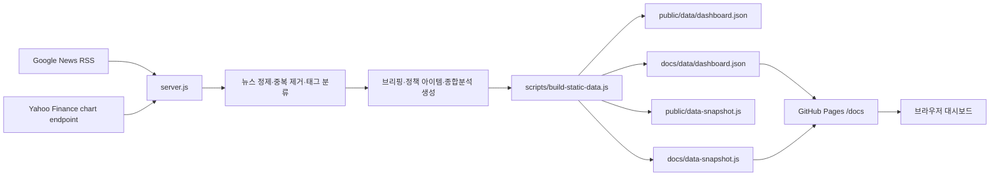

# AI Processor Daily Desk 아키텍처

이 문서는 AI Processor Daily Desk가 뉴스를 수집하고, 시장 데이터를 붙이고, 정책·예산 기획에 필요한 브리핑으로 가공한 뒤 GitHub Pages에 배포되는 구조를 설명합니다.

## 전체 구조



핵심은 서버를 계속 켜두는 방식이 아니라, GitHub Actions가 일정 주기로 데이터를 생성하고 그 결과를 정적 파일로 저장하는 구조입니다. GitHub Pages는 `/docs` 폴더의 HTML, CSS, JS, 데이터 스냅샷을 그대로 배포합니다.

## 주요 구성요소

| 영역 | 파일 | 역할 |
| --- | --- | --- |
| 데이터 수집·가공 | [server.js](./server.js) | Google News RSS, Yahoo Finance 데이터를 수집하고 기사 점수화, 태그 분류, 브리핑, 정책 아이템, 총평을 생성 |
| 정적 데이터 생성 | [scripts/build-static-data.js](./scripts/build-static-data.js) | `dashboardData()` 결과를 `public`과 `docs`의 JSON/JS 스냅샷으로 저장 |
| 화면 UI | [public/index.html](./public/index.html), [public/app.js](./public/app.js), [public/styles.css](./public/styles.css) | 로컬 실행 또는 원본 UI 소스 |
| GitHub Pages 배포본 | [docs](./docs) | GitHub Pages가 직접 읽는 정적 배포 폴더 |
| 자동 갱신 | [.github/workflows/build-pages-data.yml](./.github/workflows/build-pages-data.yml) | 정규 3시간 갱신과 보조 watchdog으로 데이터를 다시 생성하고 스냅샷 파일을 자동 커밋 |

## 데이터 수집 흐름

1. [server.js](./server.js)의 `newsQueries`에 정의된 Google News RSS 검색 쿼리를 순회합니다.
2. `fetchText()`가 RSS XML을 가져옵니다. Google News가 일시적으로 `503`을 줄 수 있어 브라우저형 User-Agent와 재시도 로직을 사용합니다.
3. `parseRss()`가 RSS 항목을 기사 객체로 변환합니다.
4. `dedupeArticles()`가 제목 기반으로 중복 기사를 제거합니다.
5. `scoreArticle()`이 기업·기술·정책 키워드를 기준으로 관련도 점수와 태그를 붙입니다.
6. `enrichArticlesFromOriginals()`가 가능한 경우 원문 링크를 읽어 요약 품질을 보강합니다.
7. 최종 기사 목록은 최대 180건까지 저장됩니다.

## 시장 데이터 흐름

시장 데이터는 Yahoo Finance chart endpoint에서 가져옵니다. 주요 해외 AI·반도체 종목, 국내 종목, 반도체 지수와 국내 지수를 수집하고, 화면에서는 일봉 캔들/종가 흐름으로 보여줍니다.

주식 색상은 한국식 관례에 맞춰 상승은 빨간색, 하락은 파란색으로 표시합니다.

## 분석·정책 아이템 생성 방식

현재 분석은 LLM API가 아니라 규칙 기반 로직입니다. 즉 기사를 매번 AI가 새로 작성하는 방식은 아니고, 수집 기사에서 잡힌 신호를 기준으로 미리 정의된 분석 문구와 정책 후보를 선택·정렬합니다.

주요 신호군은 다음과 같습니다.

- `NPU`
- `AI인프라`
- `데이터센터`
- `온디바이스AI`
- `추론`
- `파운드리·패키징`
- `수출통제·공급망`
- `정책·조달`
- `국내 NPU 기업 사업화`
- `AI 시장·서비스 수익화`

정책 아이템은 비R&D 사업 기획에 맞춰 구성되어 있습니다. 수요처 발굴, PoC, 성능·전력 검증, 조달 전환, 해외 PoC, 개발자 생태계, 데이터센터 실증 같은 사업수단을 기사 신호와 연결해 우선순위를 정합니다.

주간 보고서 도입문은 다음 문구를 표준으로 사용합니다.

> 최근 7일 Daily Desk 브리핑을 바탕으로 단순 기사 요약이 아니라 반복 이슈와 산업적 의미를 연결해 정리한 주간 분석입니다.

## GitHub Pages 배포 구조

GitHub Pages는 `/docs` 폴더를 배포 대상으로 사용합니다.

따라서 화면 소스는 두 벌이 있습니다.

- `public`: 로컬 실행과 원본 개발용
- `docs`: GitHub Pages 배포용

화면 코드를 수정할 때는 `public`을 수정한 뒤 같은 변경을 `docs`에도 반영해야 합니다. 데이터 스냅샷도 `public`과 `docs` 양쪽에 함께 저장됩니다.

## 자동 갱신 주기

[build-pages-data.yml](./.github/workflows/build-pages-data.yml)은 정규 3시간 갱신 cron과 보조 watchdog cron을 함께 사용합니다.

```yaml
schedule:
  - cron: "10 22,1,4,7,10,13 * * *"
  - cron: "43 * * * *"
```

첫 번째 cron은 한국시간 기준으로 매일 다음 시각에 데이터를 직접 갱신합니다.

- 07:10
- 10:10
- 13:10
- 16:10
- 19:10
- 22:10

두 번째 cron은 보조 watchdog입니다. 매시간 실행되며, 최신 KST 수집 슬롯이 이미 반영되어 있으면 스킵하고, 정규 슬롯이 GitHub Actions 지연 또는 누락으로 비어 있으면 `npm run build:data`를 수행합니다. 변경된 데이터 스냅샷은 `Refresh dashboard data` 커밋으로 저장됩니다.

## 장애 대응 구조

Google News RSS나 외부 금융 API는 일시적으로 실패할 수 있습니다. 특히 GitHub Actions 환경에서 Google News RSS가 `503 Service Unavailable`을 반환하는 경우가 있습니다.

이를 줄이기 위해 다음 방어 로직을 둡니다.

- RSS 요청 시 브라우저형 User-Agent 사용
- 수집 실패 시 3회 재시도
- 자동 수집에서 전체 뉴스가 0건이고 오류가 존재하면 이전 정상 뉴스 스냅샷 유지
- 시장 데이터는 새로 수집 가능한 경우 최신값으로 갱신

이 구조 덕분에 일시적인 외부 수집 장애가 발생해도 대시보드가 빈 기사 목록으로 덮어써지는 일을 줄일 수 있습니다.

## 로컬 실행과 정적 실행

로컬 서버 실행:

```powershell
npm.cmd start
```

정적 스냅샷 생성:

```powershell
npm.cmd run build:data
```

정적 스냅샷을 생성하면 `public/data/dashboard.json`, `docs/data/dashboard.json`, `public/data-snapshot.js`, `docs/data-snapshot.js`가 갱신됩니다.

## 확장 방향

현재 구조는 무료·간단 운영을 우선해 RSS와 공개 금융 endpoint 중심으로 설계되어 있습니다. 향후 정확도와 분석 품질을 높이려면 다음 방향으로 확장할 수 있습니다.

- NIPA, 과기정통부 등 정책기관 보도자료 전용 수집기 추가
- 언론사 또는 미디어 모니터링 API 연동
- 주간 Top7 또는 총평에 한정한 LLM 기반 분석 생성
- 기사 원문 수집 안정화를 위한 별도 크롤링 서비스 분리
- 정책 아이템 후보군 확대와 사업유형별 템플릿 고도화
